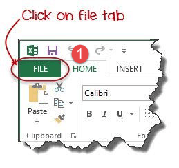
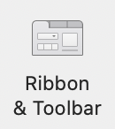

  
# Automation with Macros
Macros are a powerful tool that can help you save time by easily automating repetitive tasks in Excel. If you have any questions or get stuck as you work through this in-class exercise, please ask the instructor for assistance. 

1. Before you can record your first macro in Excel, first you need to enable the **Developer** option in the settings (you only have to do this once). This is done in slightly different ways in the Windows & Mac versions of Excel.

2. Enable Developer option in the _**Mac OSX** version of Excel  (you only have to do this once):_
  
   
  - On the top left select **Excel > Preferences** 
  - Next, click on the **Ribbon & Toolbar** icon.
  - On the right side under **Customize the Ribbon**, select **Main Tabs** and then check **Developer**.
  - Click **Save** and then close **Excel Preferences**.

3. Enable Developer option in _**Windows version of Excel**  (you only have to do this once):_
  - Select the main **FILE** tab.
  - Select **Options** at the bottom of the left-hand menu and then a popup window will appear.
  - Select **Customize Ribbon** on the left navigation bar, then click the check box beside **Developer**. Click **OK** to close the dialogue box.
  - You will now have a developer tab in your ribbon (on the right side).

4. Now that you’ve enabled the Develop tab on the ribbon, let’s download [this spreadsheet with data for this exercise](https://bit.ly/dsc-pivot-table)

5. Open the **dsc-pivot-table.xlsx** spreadsheet that you just downloaded. Note: You may have a yellow bar at the top with a button that says **Enable Editing**. Click on the button to enable editing.

6. We are now going to record a macro to sort the spreadsheet by attendance (from high to low) and then add a sum of the total attendance:
  - Start recording the Macro by clicking on the **Developer** tab in the ribbon, and then click on the **Record Macro** button.
  - In the Macro name field type: **SortAttendance** (with no space between the words), and then press the **OK** button.
  - Sort by attendance: 
              - Select all the data in columns A, B, & C (from A1 to C34).
              - Click on the **Data** tab on the ribbon and then click on the **Sort** button.
              - Click on the **Column drop-down** and select **Total Attendance**.
              - Click on the **Order** drop-down and select **Largest to Smallest**. 
              - Then click the **OK** button
  - Let’s add a sum of total attendance to the top right of the spreadsheet:
              - In cell E2 type: **Total**
              - In cell F2 type: **=sum(C2:C34)**
  - Save as a macro by clicking on the **Developer** tab in the ribbon, and then click on the **Stop Recording** button.
  - Save your spreadsheet by going to **File > Save As…** menu and then in the File Format field, select **Excel Macro-Enabled Workbook (.xlsm)**, and press the **Save** button.
  ### - Please leave your dsc-pivot-table.xlsx spreadsheet Open in the background as you work through steps 7 and 8 or else you will have problems completing this activity!

7. Use the Macro on a different spreadsheet to sort it by attendance and sum the attendance:
  - [Download spreadsheet](https://bit.ly/dsc-excel-macro)(while keeping the spreadsheet you created the macro in open in the background)
  - Open the **dsc-october.xlsx** spreadsheet you just downloaded. Note: You may have a yellow bar at the top with a button that says **Enable Editing**. Click on the button to enable editing.
  - Open the list of macros available to you by clicking on the **Developer** tab in the ribbon, and then click on the **Macros** button.
  - Select the **‘dsc-pivot-table.xlsm’!SortAttendance** macro and then press the **Run** button. Your spreadsheet should now look like this:

8. Go Further:Edit your script to expand the range of cells that the macro will modify...

_Great job!_

[NEXT STEP: Creating a Digital Dashboard](digital-dashboard.html){: .btn .btn-blue }
