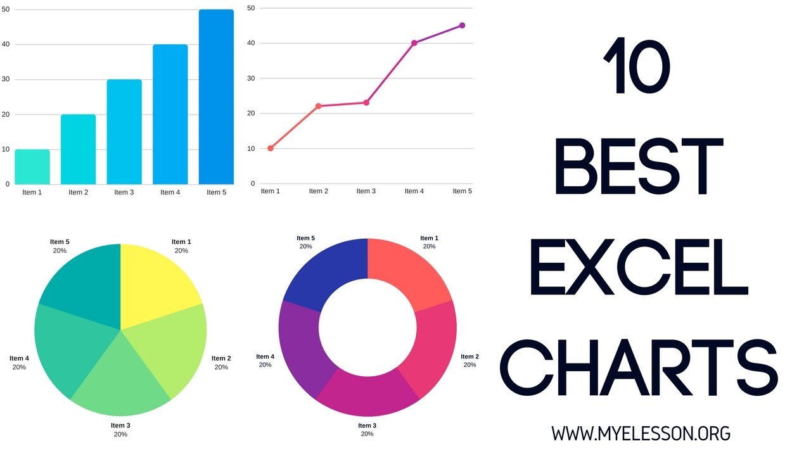
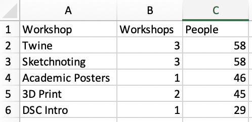
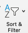
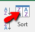
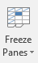

 
# Charting, Graphs and More with Excel
In this activity, you will produce some graphs and charts in Excel. If you have any questions or get stuck as you work through this in-class exercise, please ask the instructor for assistance.  Have fun!

1. Let’s start by getting a new spreadsheet setup. 
  - At the very bottom of the spreadsheet, beside the **Sheet 1** tab, click on the **+** button to create a new sheet.
  - Enter the following information into the new sheet:
 
  
 
2. **Sorting**: Sort by the number of workshops held (column B): 
  - Click on cell **A1** and drag your mouse to **C6**, highlighting all boxes
  - Click on the green **Data** tab on the top menu.
  - Click on the **Sort** button on the top menu (see right). Note: If the sort Filter button is not visible, increase the size of your Excel window so that more tools are displayed on the ribbon.
  - A dialogue box will pop up. Click on the **Column** drop-down, and select **Workshops**.
  - Click on the **Order** drop-down and select **Largest to Smallest**. 
Press OK and the spreadsheet will re-order so that the workshop list is reordered from most to least number of workshops held.
 
 
3. **Formatting Columns & Rows**:
  - Make column A wider by grabbing the grey line between columns A & B and dragging it to the right. Try changing the width of a row on your own.
  
  - Insert a new column by **right-mouse-clicking** on column **B**, and then **clicking** on **Insert** in the popup menu. 
  - Type **Test** into cell **B1**. Click on **Row 1** and try inserting a row on your own now.
 
  - Hide a column by **right mouse clicking** on column **B**, and then **selecting Hide** from the popup menu. 
  - **Unhide** it by **selecting** columns **A** and **B**, then **right mouse click** on **B** and select Unhide. Note If you don’t have a mouse please double click with your trackpad on the slightly thicker line between column **A** and **C**. 
 
 
4. **Freezing rows or Columns**: This is particularly useful on spreadsheets with a lot of data so that you can scroll vertically and horizontally and still see your column and row labels.

  - **Click** on the green **View** tab on the top menu.
  - **Click** on the **Freeze Panes** on the top menu, and then **select Freeze Top Row**. You can now scroll as far as you want vertically and you will always see the labels on your top row.
  - **Click** on the **Freeze Panes** on the top menu, and then select **Freeze First Column**. You can now scroll as far as you want horizontally and you will always see the labels in column A.

5. **Pie Chart**:
  - Delete column **B** (where you typed “Test” in step 3c) by **right-mouse-clicking** on column **B**, and then **clicking** on **Delete** in the popup menu. 
  - Select all the first two columns in the sheet, by **dragging** from **A1** to **B6**. **Click** on the green **Insert** tab on the top menu.
  - **Click** on the **Recommended Charts Button** on the top menu, and then **select** the **Pie Chart Graph**. **Click OK**.
  - You can now select the type of pie chart you’d like to use from the top ribbon. Don’t forget to scroll to see more pie chart formats! 

6. **Bar Chart with trendline**:
  - Select all the cells in the sheet, by dragging from A1 to C6.
  - Click on the green Insert tab on the top menu.
  - Click on the Recommended Charts Button on the top menu, and then scroll down and select the Clustered Column chart. Click OK.
  - Click on the Add Chart Element button, and then mouse over Trendline, and select Linear. 
  - When the dialogue box appears, select People, and then press OK.
  - You should now have a chart that looks like the one to the right.

7. **Scatterplot with Trendline:** 
  - Download and open [this Excel spreadsheet](https://bit.ly/3eujqsm){:target="_blank"}  Note: You may have a yellow bar at the top with a button that says **Enable Editing**. Click on that to enable editing.
  - Select cells **A1** to **B46**. 
  - Click on the Insert tab, and then click on the **Recommended Charts** button, and select the first recommended chart which should be a **Scatter** chart. Click **OK**.
  - To add a trendline, click on the **Add Chart Elements** button on the top left toolbar, and then **Trendline** and then **Linear**.
  - You should now have a Scatter plot chart with a linear trend line.
  - To add a label to the vertical axis click on the **Add Chart Elements** button on the top left toolbar, and then **Axis Titles** and then **Primary Vertical**. 
  - Click on the new axis label, highlight the current text, and then type **Grade**.
  - Do the same for the horizontal Axis, and type **Homework Assignments Completed**.
  - To change the chart title, double click on the title which is currently “Grade”, and then change it to: **Grade Homework Assignment Correlation**.

OPTIONAL:
8. **Histogram**:  [Instructions](http://bit.ly/2I78FNh){:target="_blank"} for how to create a Histogram chart.
9. **Line Chart**: [Instructions](http://bit.ly/2HXiIEk){:target="_blank"} for how to create a Line chart.
10. **Box & Whisker**: [Instructions](http://bit.ly/2I90O1w){:target="_blank"} for how to create a Box and Whisker chart

[NEXT STEP: Pivot Tables and Pivot Charts](pivot-tables-charts.html){: .btn .btn-blue }
